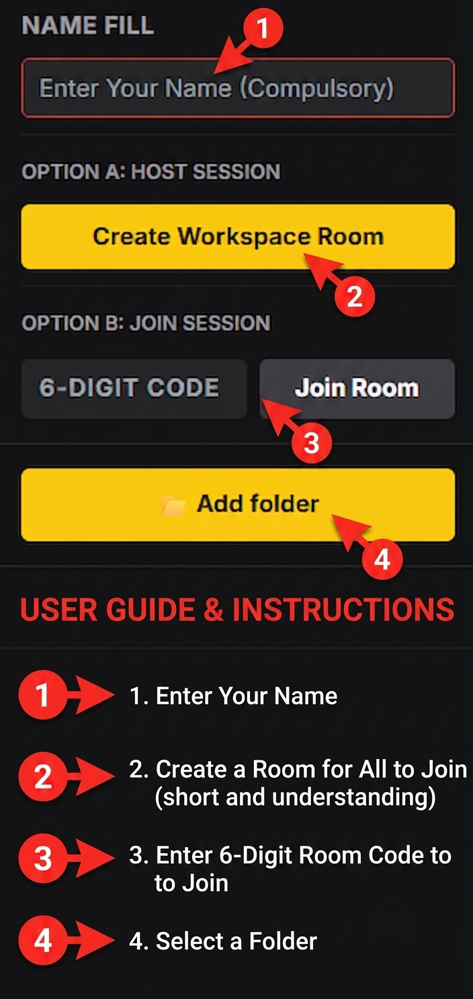
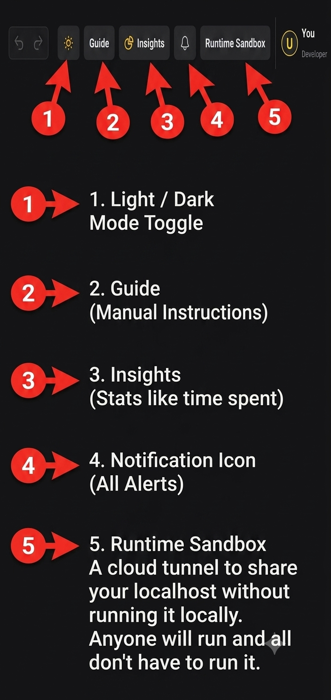
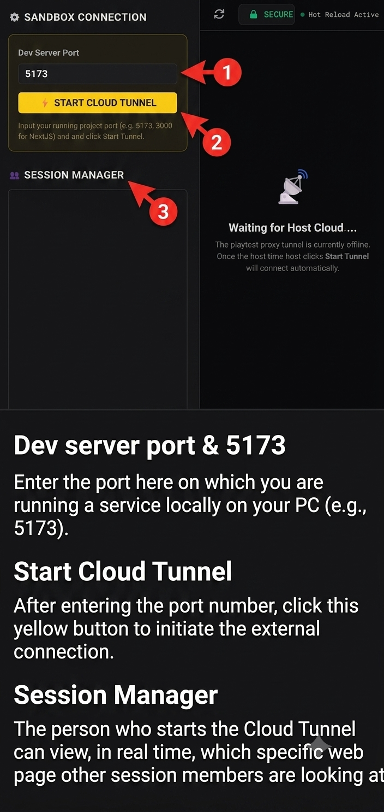
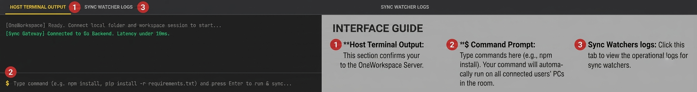
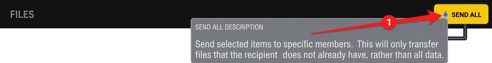

# 

> **Real-time file synchronization for developer teams.** Synchronize your project folders instantly between laptops and desktops without Git push/pull cycles or cloud server storage.

  

---

## What is OneWorkspace?

OneWorkspace is a lightweight desktop application that synchronizes project folders in real-time between developers. Teammates can write, run, and debug code together as if they were sharing a single computer.

* **Private Sync:** Your folders sync directly between devices. Your files are never stored on external cloud servers.
* **Compatible with all Editors:** Works out-of-the-box with Cursor, VS Code, Windsurf, IntelliJ, Sublime Text, Vim, and all other text editors.
* **Instant Collaboration:** Updates folder content immediately as you write.

---

## Features

* **Instant Folder Syncing**: Real-time folder replication between team members.
* **Shared Command Terminal**: Broadcast and execute command prompt actions across all connected machines simultaneously.
* **Dev Server Tunnels**: Share local ports securely so team members can inspect and playtest active projects.
* **Auto-Discovery**: Works automatically over Local Area Networks (LAN) and internet connections.

---

## Interface Guide

### 01. Setup Workspace
Choose a folder and generate a secure session code. Teammates enter this code to link their local folders.

### 02. Utilities Toolbar
Toggle dark/light visual modes, access local manuals, inspect active syncing logs, and read alert notifications.

### 03. Cloud Sandbox
Share your running local web servers securely so teammates can preview changes in real time.

### 04. Terminal Output
Track latency connection speeds and run synchronized terminal commands across all connected machines.

### 05. Send All
Send selected items to specific members. This will only transfer files that the recipient does not already have, rather than all data.

---

## Download OneWorkspace

OneWorkspace is exclusively available for download on our official landing page. Visit the website to get the latest builds for Windows (x64 / ARM64) and macOS (Apple Silicon):

👉 **[Download on Official Website](https://www.oneworkspace.online/)**

---

## Trust & Security

* **Open-source components used**
* **Virus-free installer**
* **No bundled software**
* **No ads**
* **No cryptocurrency miners**

### Bypassing Operating System Warnings

Because OneWorkspace is a new application, Windows and macOS warnings are expected until code signing reputation is built up. Follow these guides to install safely:

#### Windows SmartScreen Bypass
1. If you see *"Windows protected your PC"*, click **More info**.
2. Click the **Run anyway** button.
3. The installer will launch and install normally.

#### macOS Gatekeeper Bypass
1. Locate the downloaded `.dmg` or application icon.
2. **Right-click** (or Control-click) the application.
3. Click **Open** from the menu.
4. Click **Open anyway** to run.
